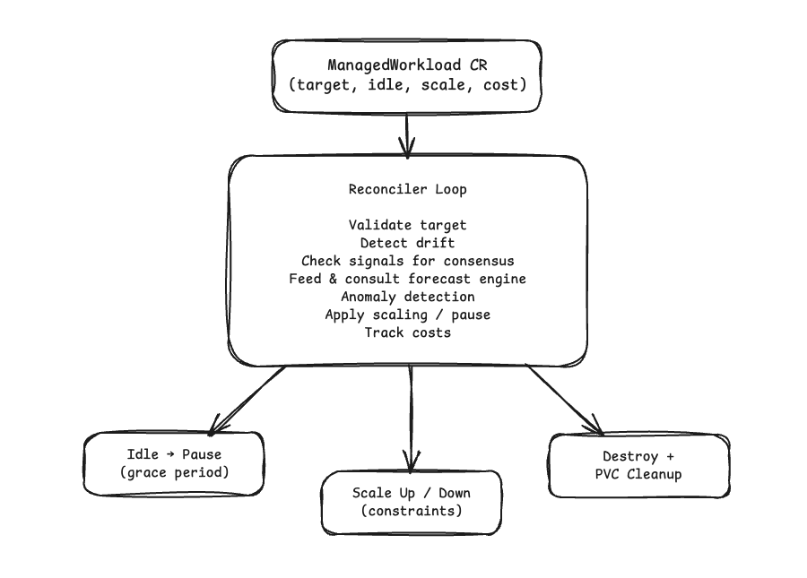
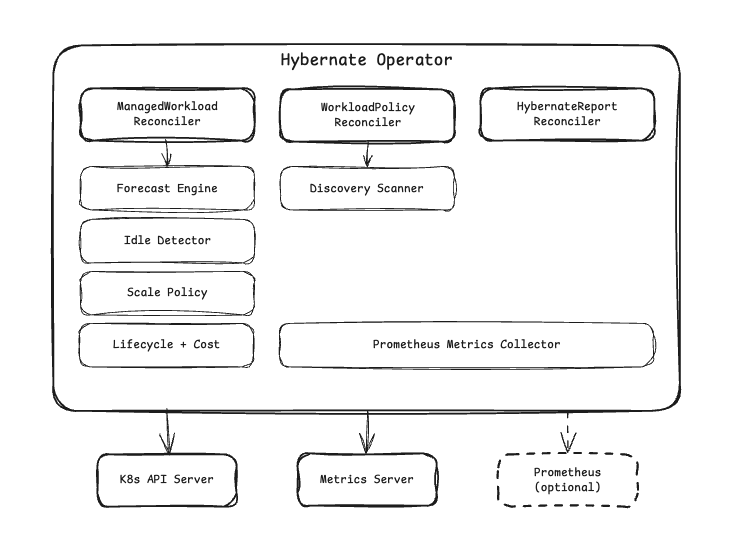

# Hybernate

[](https://go.dev)
[](LICENSE)
[](https://kubernetes.io)

**Your Kubernetes workloads are running 24/7. Your users aren't.**

Hybernate is a Kubernetes operator that detects idle workloads, learns their demand patterns, and automatically pauses, scales, or destroys them. It brings them back before traffic returns, turning your non-production clusters from always-on cost centers into pay-for-what-you-use environments.

## Why Hybernate?

Most staging, dev, and test workloads sit idle 60-80% of the time: nights, weekends, holidays. You're paying for compute that nobody is using.

Hybernate fixes this by:

- **Detecting idle workloads** using CPU + memory metrics and optional Prometheus signals, with a consensus model that prevents false positives
- **Learning demand patterns** via a per-workload Holt-Winters forecasting model that tracks daily and weekly seasonality
- **Acting automatically** by pausing idle workloads, scaling based on predicted demand, and resuming proactively before users arrive
- **Tracking savings** with per-workload cost accounting, resource reduction metrics, and cluster-wide aggregation

## How It Works



1. You point Hybernate at a Deployment or StatefulSet
2. The operator monitors CPU, memory, and optional Prometheus signals
3. A per-workload forecast model learns when the workload is typically busy
4. When all signals confirm idle and the forecast agrees, the workload is paused
5. Before the next busy period, the forecast triggers an automatic resume

## Quick Start

**Install:**

```bash
helm install hybernate oci://ghcr.io/okedeji/charts/hybernate \
  --namespace hybernate-system \
  --create-namespace
```

**Discover and manage idle workloads in a namespace:**

```yaml
apiVersion: hybernate.io/v1alpha1
kind: WorkloadPolicy
metadata:
  name: staging-policy
  namespace: staging
spec:
  mode: auto-manage
  cpuIdleThreshold: 50
  memoryIdleThreshold: 104857600
  dryRun: true
```

```bash
kubectl apply -f workloadpolicy.yaml
kubectl get workloadpolicy staging-policy -n staging
```

```
NAME             MODE          DISCOVERED   ACTIVE   IDLE   WASTEFUL   PROJECTED COST   PROJECTED SAVINGS
staging-policy   auto-manage   12           8        2      2          $340.00           $89.00
```

Start with `dryRun: true` to observe. When you're confident, set it to `false` to enable automation.

**Or manage a single workload directly:**

```yaml
apiVersion: hybernate.io/v1alpha1
kind: ManagedWorkload
metadata:
  name: my-api
  namespace: staging
spec:
  target:
    kind: Deployment
    name: my-api
  idlePolicy:
    cpuIdleThreshold: 50
    gracePeriod: "5m"
    autoResume: true
  prediction:
    confidence: 85
  dryRun: true
```

## Features

### Core

- **Multi-signal idle detection** using CPU + memory thresholds with Prometheus PromQL signals, consensus-based confirmation, and configurable grace periods
- **Demand forecasting** via a Holt-Winters double seasonal model that learns daily and weekly patterns per workload, with confidence scoring and anomaly detection
- **Prediction-driven scaling** where replica counts adjust based on forecasted demand with stabilization windows, step limits, and guard probes
- **Pause, resume, and destroy** with scale to zero, automatic expiry, forecast-driven resume, and PVC retention

### Operations

- **Auto-discovery** lets WorkloadPolicy scan namespaces, classify workloads as Active/Idle/Wasteful, and optionally auto-create ManagedWorkloads
- **GitOps export** via `kubectl hybernate export` generates ManagedWorkload manifests for ArgoCD/Flux workflows
- **Cost tracking** with per-workload resource consumption, estimated savings, and concrete resource reduction metrics
- **Dry-run mode** to observe every decision the operator would make without it taking action

### Observability

- **30+ Prometheus metrics** across three tiers: cluster health, operational insight, and debugging
- **Grafana dashboard** included with cost, lifecycle, and prediction panels
- **Kubernetes events** for every state change, visible in `kubectl describe`

## Architecture



| Component | Description |
|-----------|-------------|
| **ManagedWorkload** | Per-workload CR that defines idle policy, scale policy, pause/destroy behavior, and cost tracking |
| **WorkloadPolicy** | Namespace-scoped scanner that discovers, classifies, and optionally auto-manages workloads |
| **HybernateReport** | Cluster-wide singleton that aggregates cost, savings, and resource reduction across all workloads |
| **Forecast Engine** | Per-workload Holt-Winters model that learns demand patterns, gates idle detection, and drives scaling |

## Documentation

Full docs at **[okedeji.io/hybernate](https://okedeji.io/hybernate)**

- [Installation](https://okedeji.io/hybernate/getting-started/installation/): Helm, kubectl, and source
- [Quickstart](https://okedeji.io/hybernate/getting-started/quickstart/): manage your first workload
- [Idle Detection](https://okedeji.io/hybernate/concepts/idle-detection/): how signals, forecasts, and grace periods work
- [Forecasting](https://okedeji.io/hybernate/concepts/forecasting/): the Holt-Winters prediction engine
- [Cost Tracking](https://okedeji.io/hybernate/concepts/cost-tracking/): resource reduction vs. estimated savings
- [API Reference](https://okedeji.io/hybernate/reference/api/): complete CRD field reference
- [Metrics Reference](https://okedeji.io/hybernate/reference/metrics/): all Prometheus metrics

## Contributing

We welcome contributions. See [CONTRIBUTING.md](CONTRIBUTING.md) for development setup, coding standards, and PR guidelines.

## Security

To report a security vulnerability, see [SECURITY.md](SECURITY.md).

## License

Copyright 2026. Licensed under the [Apache License, Version 2.0](LICENSE).
