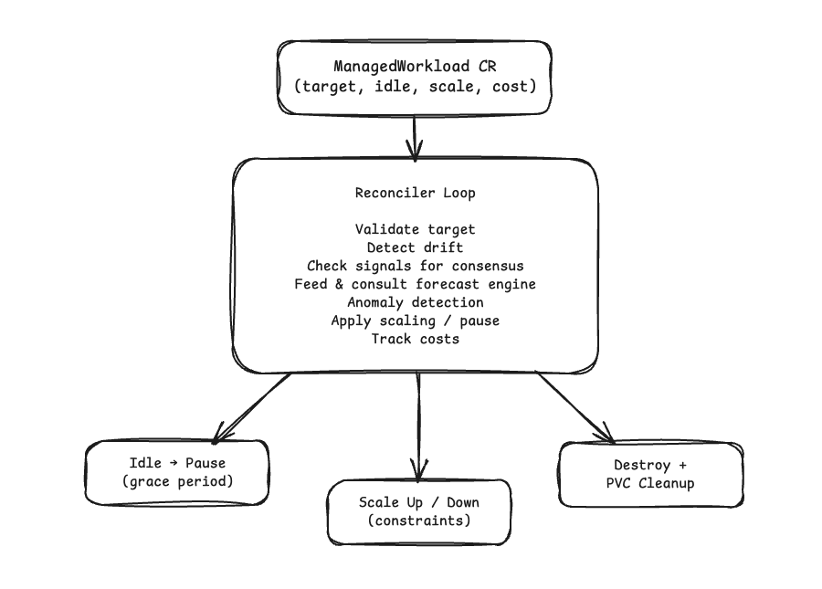
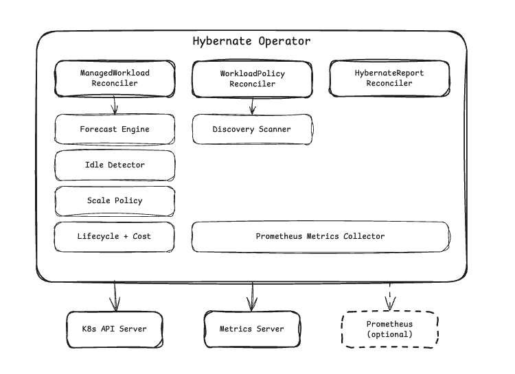

# Hybernate

[](https://go.dev)
[](LICENSE)
[](https://kubernetes.io)

**Your Kubernetes workloads are running 24/7. Your users aren't.**

Hybernate is a Kubernetes operator that detects idle workloads, learns their demand patterns, and automatically pauses or destroys them. It brings them back before traffic returns, turning your non-production clusters from always-on cost centers into pay-for-what-you-use environments.

## Why Hybernate?

Most staging, dev, and test workloads sit idle 60-80% of the time: nights, weekends, holidays. You're paying for compute that nobody is using.

Hybernate fixes this by:

- **Detecting idle workloads** with a per-workload activity clock: CPU, deploys, Prometheus queries, and activity annotations from your own tooling, with no learning period
- **Learning demand patterns** via a per-workload Holt-Winters forecasting model that tracks daily and weekly seasonality
- **Acting automatically** by pausing idle workloads and resuming proactively before users arrive
- **Tracking savings** with per-workload cost accounting, resource reduction metrics, and cluster-wide aggregation

## How It Works



1. You point Hybernate at a Deployment or StatefulSet
2. The operator tracks when the workload was last active: CPU, deploys, and activity annotations
3. A per-workload forecast model learns when the workload is typically busy
4. When nothing has been active for `idleAfter` (default 1 hour), the workload is paused
5. Before the next busy period, the forecast triggers an automatic resume

## Quick Start

**Install:**

```bash
helm install hybernate oci://ghcr.io/okedeji/charts/hybernate \
  --version v0.1.7 \
  --namespace hybernate-system \
  --create-namespace
```

**Discover and manage idle workloads in a namespace:**

```yaml
apiVersion: hybernate.io/v1alpha1
kind: WorkloadPolicy
metadata:
  name: staging-policy
  namespace: staging
spec:
  mode: auto-manage
  cpuIdleThreshold: 10
  memoryIdleThreshold: 10
  dryRun: true
```

```bash
kubectl apply -f workloadpolicy.yaml
kubectl get workloadpolicy staging-policy -n staging
```

```
NAME             MODE          DISCOVERED   ACTIVE   IDLE   PROJECTED COST   PROJECTED SAVINGS
staging-policy   auto-manage   12           10       2      $340.00          $89.00
```

Start with `dryRun: true` to observe. When you're confident, set it to `false` to enable automation.

**Or manage a single workload directly:**

```yaml
apiVersion: hybernate.io/v1alpha1
kind: ManagedWorkload
metadata:
  name: my-api
  namespace: staging
spec:
  target:
    kind: Deployment
    name: my-api
  idlePolicy:
    idleAfter: 1h
    autoResume: true
  prediction:
    confidence: 85
  dryRun: true
```

## Features

### Core

- **Activity-based idle detection**: any sign of use (CPU, a deploy, a Prometheus query such as request rate, an activity annotation) keeps a workload awake; it pauses after `idleAfter` with none
- **Demand forecasting** via a Holt-Winters double seasonal model that learns daily and weekly patterns per workload, with confidence scoring and anomaly detection
- **Wake on request**: a request to a paused workload's Service wakes it and is held until the workload is Ready, so callers see a slow response instead of an error. Browsers get a waking-up page that reloads until the app is up
- **Pause, resume, and destroy** with scale to zero, automatic expiry, forecast-driven resume, and PVC retention

### Operations

- **Auto-discovery** lets WorkloadPolicy scan namespaces, classify workloads as Active or Idle, and optionally auto-create ManagedWorkloads
- **`kubectl hybernate wake`** wakes a paused workload from the terminal and waits until it's Running
- **GitOps export** via `kubectl hybernate export` generates ManagedWorkload manifests for ArgoCD/Flux workflows
- **Cost tracking** with per-workload resource consumption, estimated savings, and resources freed
- **Dry-run mode** to observe every decision the operator would make without it taking action

### Observability

- **Prometheus metrics** for operator health, lifecycle transitions, and prediction state, with alerting rules for the Helm chart
- **Kubernetes events** for every state change, visible in `kubectl describe`

## Architecture



| Component | Description |
|-----------|-------------|
| **ManagedWorkload** | Per-workload CR that defines idle policy, pause/destroy behavior, and cost tracking |
| **WorkloadPolicy** | Namespace-scoped scanner that discovers, classifies, and optionally auto-manages workloads |
| **Forecast Engine** | Per-workload Holt-Winters model that learns demand patterns, confirms idle detection, and wakes workloads ahead of demand |

## Documentation

Full docs at **[okedeji.io/hybernate](https://okedeji.io/hybernate)**

- [Installation](https://okedeji.io/hybernate/getting-started/installation/): Helm, kubectl, and source
- [Quickstart](https://okedeji.io/hybernate/getting-started/quickstart/): manage your first workload
- [Idle Detection](https://okedeji.io/hybernate/concepts/idle-detection/): how the activity clock decides when to pause
- [Forecasting](https://okedeji.io/hybernate/concepts/forecasting/): the Holt-Winters prediction engine
- [Cost Tracking](https://okedeji.io/hybernate/concepts/cost-tracking/): resource reduction vs. estimated savings
- [API Reference](https://okedeji.io/hybernate/reference/api/): complete CRD field reference
- [Metrics Reference](https://okedeji.io/hybernate/reference/metrics/): all Prometheus metrics

## Contributing

We welcome contributions. See [CONTRIBUTING.md](CONTRIBUTING.md) for development setup, coding standards, and PR guidelines.

## Security

To report a security vulnerability, see [SECURITY.md](SECURITY.md).

## License

Copyright 2026. Licensed under the [Apache License, Version 2.0](LICENSE).
