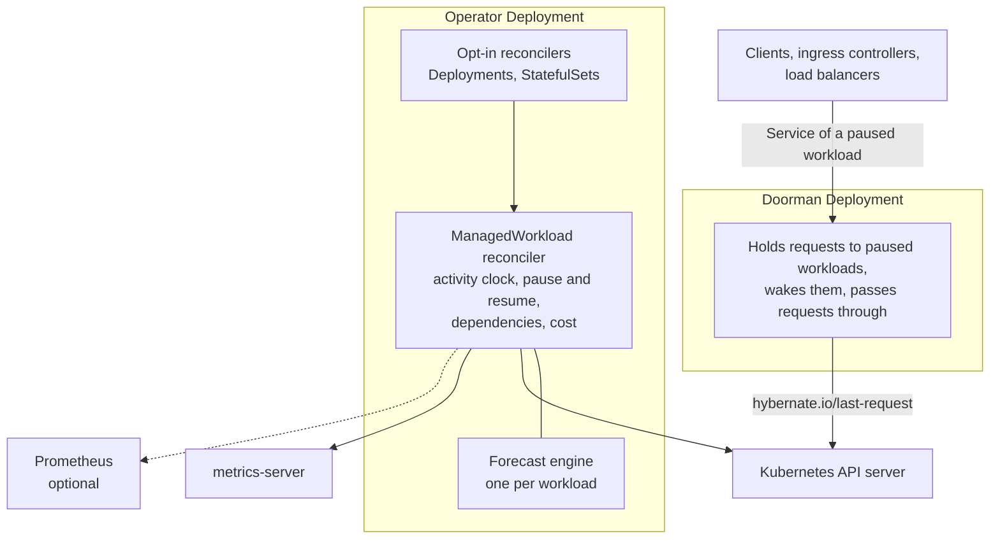

# Architecture

Hybernate is a Kubernetes operator built on [controller-runtime](https://github.com/kubernetes-sigs/controller-runtime). It runs as one binary inside your cluster, in two Deployments: the operator, which manages workloads through two kinds of reconciliation loop, and the [doorman](wake-on-request.md), which holds requests to paused workloads and wakes them.

## Components

## Reconcilers

### ManagedWorkload Reconciler

The primary reconciler. Watches `ManagedWorkload` CRs and drives each workload through its lifecycle. On every reconcile it:

1. Checks for another ManagedWorkload managing the same target
2. Validates the target Deployment/StatefulSet exists and isn't ignored, and that its namespace isn't protected; if either changes, it lets go of the workload, scaling a paused one back up
3. Wakes a paused workload scaled up outside Hybernate
4. Learns the workload's dependencies from its environment
5. Routes a paused workload's Services to the doorman, or stops routing them
6. Finishes a pause or resume an earlier reconcile started
7. Processes manual overrides (`desiredState`)
8. Runs the activity clock: records activity, and pauses once there has been none for `idleAfter`; for a paused workload, checks whether anything asks it to wake
9. Accumulates cost data and writes status

Each ManagedWorkload gets its own forecast engine instance, serialized into the CR status so it survives operator restarts. Every reconcile is bounded by a timeout, and `--max-concurrent-reconciles` (4 by default) workloads are reconciled at once, so one slow metrics or Prometheus query doesn't hold up another workload's wake.

### Opt-In Reconcilers

One for Deployments and one for StatefulSets. Each watches its workloads, their namespaces, and the ManagedWorkloads created from them. When a workload or its namespace is labelled `hybernate.io/managed: "true"`, it creates a ManagedWorkload named after the workload (or `<name>-<kind>` when that name is taken) and owned by it, with a spec built from the workload's annotations, then its namespace's, then the cluster-wide defaults. It keeps the fields the annotations set in step with them, leaves the rest as you set them, and deletes the ManagedWorkload when the label goes. A ManagedWorkload someone wrote for the same workload always wins.

## Internal Packages

| Package | Responsibility |
|---------|---------------|
| `internal/controller` | The ManagedWorkload and opt-in reconcilers |
| `internal/forecast` | Holt-Winters model, phase lifecycle, confidence scoring, anomaly detection |
| `internal/signal` | Prometheus PromQL activity queries |
| `internal/autoscaler` | Finds a workload's HPA or KEDA ScaledObject, and holds a KEDA one at zero while it's paused |
| `internal/gitops` | Tells from field managers whether Argo CD or Flux sets a workload's replicas, and how to tell it to leave them |
| `internal/lifecycle` | Pause and resume, through the scale subresource |
| `internal/discovery` | The cluster scan behind `kubectl hybernate scan` |
| `internal/doorman` | Holds requests to a paused workload's Service and wakes it |
| `internal/cost` | Cost rates, node list prices, and monthly projection |
| `internal/metrics` | Prometheus metric definitions and K8s Metrics API reader |

## External Dependencies

Hybernate reads from three external systems:

- **Kubernetes API Server**: for managing Deployments, StatefulSets, PVCs, and CRs
- **Metrics Server**: for pod CPU usage (required)
- **Prometheus**: for PromQL activity queries (optional)

## Node-Level Cost Savings

Hybernate operates at the workload layer. It does not manage nodes directly. When Hybernate pauses or scales down a workload, it frees CPU and memory on the node. A cluster autoscaler (Cluster Autoscaler, Karpenter, or a managed equivalent) is responsible for detecting underutilized nodes and removing them to realize actual infrastructure cost savings.

See the [Cluster Autoscaler Guide](../guides/cluster-autoscaler.md) for recommended configurations.

## Leader Election

When running multiple operator replicas for high availability, Hybernate uses controller-runtime's leader election (`--leader-elect`). Only the leader runs reconciliation loops; standby replicas take over if the leader fails. The doorman doesn't elect a leader: every replica serves traffic.

## Security Model

- The operator runs as a non-root user in a distroless container
- RBAC is scoped to the minimum required permissions; see [Data and Access](../reference/data-and-access.md#rbac)
- Metrics are served over HTTPS by default with authentication
- HTTP/2 is disabled by default to mitigate known vulnerabilities
