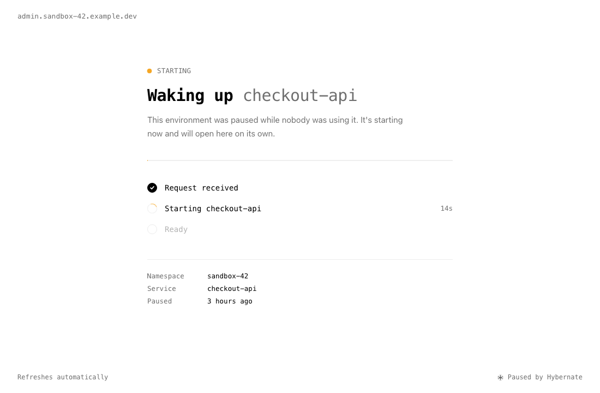

# Wake on Request

A paused workload has no pods, so nothing answers its Service. With wake on request, the first request wakes it instead: the connection is held while the workload starts, then passed to one of its Ready pods. The caller sees one slow response, not an error.

It's on by default for every workload Hybernate pauses on its own. There's nothing to configure.

## How it works

Hybernate runs a small proxy, the **doorman**, as its own Deployment (two replicas, with a PodDisruptionBudget) next to the operator.

1. When a workload pauses, the operator finds every Service that selects its pods and adds an extra EndpointSlice to each, one per IP family, pointing at the doorman's pods on a port of their own (20000-29999). The Service, its ClusterIP, and its DNS name don't change, so callers and Ingresses need no changes. IPv4, IPv6 and dual-stack Services are all supported.
2. A connection to the Service reaches the doorman. If one of the Service's pods is already Ready, because the workload is waking or another workload's pods serve the Service, the connection goes straight to it. Otherwise, once the caller has sent something, the doorman holds the connection and sets `hybernate.io/last-request` on the ManagedWorkload, which wakes it the same way as an [activity annotation](idle-detection.md#activity-annotations). A `WokenByRequest` event names the Service, and once the workload is Running, its clock shows `lastActivitySource: request`.
3. The doorman watches the Service's own EndpointSlices. As soon as a pod is Ready, it connects to one of the Ready pods and passes the held connection through, including any bytes the caller already sent.
4. Once the workload is `Running`, the operator removes the doorman's EndpointSlices and traffic goes straight to the pods again. For 30 seconds after that, the doorman still passes connections that reach it to the Ready pods, without waking anything, while kube-proxy and load balancers catch up.

The doorman works on TCP connections, not HTTP requests, so it handles any TCP protocol: HTTP, gRPC, Postgres, Redis. Waking a workload also wakes its [dependencies](dependencies.md).

Ingress controllers, Gateway API implementations, and cloud load balancers that read EndpointSlices reach the doorman the same way. See [Compatibility](../reference/compatibility.md) for which have been checked.

```
WakeOnRequest=True   DoormanRouted   requests are held and wake the workload
```

### What wakes a workload, and what doesn't

| The caller | What happens |
|------------|--------------|
| Sends bytes: an HTTP request, a TLS handshake, a database protocol's first message | Held, and the workload wakes |
| Connects and sends nothing for 3 seconds | Held, and the workload wakes: it's taken for a protocol where the server speaks first, such as MySQL |
| Connects and closes without sending anything, like a TCP health check | Closed; nothing wakes |
| An HTTP `GET` or `HEAD` whose `User-Agent` starts with `kube-probe/`, `Prometheus/`, `vm_promscrape`, `GrafanaAgent/`, `Alloy/`, `OpenTelemetry Collector`, `otelcol`, `Datadog Agent/`, `ELB-HealthChecker/`, `GoogleHC/` or `Envoy/HC` | Answered `503 Service Unavailable` with `Connection: close` while no pod is Ready; nothing wakes. Probes and scrapers would otherwise keep a workload awake forever. Once a pod is Ready they're passed through like any other request |
| An HTTP `GET` or `HEAD` whose `User-Agent` starts with one you added with the Helm value `doorman.healthCheckUserAgents`, such as an in-house uptime monitor's | Answered `503` as above; nothing wakes |
| Any other method from those agents, such as a Prometheus remote write or an Alertmanager notification `POST` | Held, and the workload wakes: it's data for the workload, not a check on it |
| An HTTP request for a hidden file: a path with a part that starts with a dot, such as `/.env`, `/.git/config` or `/.aws/credentials`, except under `/.well-known/` | Answered `404 Not Found`; nothing wakes. Scanners probe every address on the internet for these, hunting for leaked secrets, and no app serves them to its users |

Your own health checkers and scrapers are recognised once you add their `User-Agent` prefixes, cluster-wide:

```yaml
doorman:
  healthCheckUserAgents: ["MyCorpMonitor/", "uptime-kuma"]
```

To keep the doorman off a port altogether, such as a metrics port something else scrapes, list it on the Service. Ports are named in the Service's `ports`, and the annotation takes either the name or the number:

```yaml
kind: Service
metadata:
  annotations:
    hybernate.io/doorman-ignore-ports: "metrics"   # or "9090", or both: "metrics,9090"
spec:
  ports:
    - name: http
      port: 80
    - name: metrics
      port: 9090
```

Listed ports are never routed, so connections to them fail while the workload is paused, as they would without Hybernate.

### Health checks the doorman can't recognise

The doorman can only tell a health check from a real caller by reading it. Two kinds reach a paused workload on its traffic port and wake it every time they run, so it never stays paused for longer than their interval:

- **HTTPS and other TLS health checks.** The request is encrypted, so the doorman can't see its `User-Agent`. AWS target groups that use HTTPS check over HTTPS by default, as do Google Cloud backend services that use HTTPS or HTTP/2.
- **HTTP checks and scrapers whose `User-Agent` isn't recognised**, such as an uptime monitor you haven't added to `doorman.healthCheckUserAgents`.

`hybernate.io/doorman-ignore-ports` can't help when the checked port is the traffic port, since ignoring it would stop requests waking the workload too. Instead, either:

- **Check over plain HTTP.** The AWS and Google Cloud health checkers send a `User-Agent` the doorman recognises, so it answers them `503` without waking anything.
- **Check a port of its own,** one the workload serves only for health checks, and list it in `hybernate.io/doorman-ignore-ports`.

Either way, the load balancer sees the workload as unhealthy while it's paused, as it would without Hybernate. That's what lets it pause, and it's what makes the first request after a pause slow rather than instant. Most load balancers still send requests when every target is unhealthy (AWS's Application and Network Load Balancers fail open), so the first request still reaches the doorman and wakes the workload. Some answer with an error instead until a target is healthy again; check yours before relying on wake on request behind it.

### Environments on the public internet

Wake on request wakes a paused workload for any request it can't recognise as a health check, and on the public internet most requests are robots: search engine crawlers, and scanners that try every address for known weaknesses. Many of them present an ordinary browser's `User-Agent` on purpose, so no list of agents can keep up with them. A paused workload anyone on the internet can reach is woken by them every few minutes, and saves little.

The doorman turns away the scanners hunting for leaked secrets in hidden files, as above, but not the rest. Put non-production environments behind a VPN, single sign-on at the ingress, or an allowlist of your offices' and VPN's addresses. That keeps the robots away from them, which pausing needs, and keeps unfinished work away from the internet, which a staging or preview environment needs anyway.

### Services shared with other workloads

A Service is routed to the doorman only while none of its pods is Ready. When several workloads sit behind one Service, such as a canary and a stable Deployment, traffic goes to whichever has Ready pods, and a paused one behind it reports `WakeOnRequest=False` with reason `ServedByOtherPods`. Once every workload behind the Service is paused, the Service is routed and a request wakes them.

The operator reads the Service's own EndpointSlices from the API server when it decides, since it doesn't cache other workloads' endpoints, and decides again every 30 seconds while another workload's pods serve the Service. So a Service whose other pods all go is routed within 30 seconds; until then, requests to it fail as they would without Hybernate.

## Browsers

A browser opening a paused workload doesn't sit on a blank tab. The doorman answers straight away with a page that says the environment is starting, and reloads itself every 3 seconds. It shows the address the person opened, so it reads as part of their environment, and, once the workload is `Resuming`, how long it has been starting. It names no namespace, workload or Service. As soon as any of the workload's pods is Ready, the next reload is passed through to the app.



The page is only for a browser loading a page: a `GET` or `HEAD` with `Sec-Fetch-Mode: navigate`, which browsers send when you open a URL, or, from older browsers, one that asks for HTML. Scripts' requests, API clients, form posts, WebSockets, TLS, and other protocols are held as usual. The doorman tells them apart from the first bytes the caller sends, then passes those bytes on unchanged when it holds the connection.

The page is sent as `503 Service Unavailable` with `Cache-Control: no-store`, `Retry-After: 3` and `X-Robots-Tag: noindex`, so caches, crawlers, and monitors don't mistake it for the app. Because it answers at once, a proxy's timeout doesn't matter for browsers, however long the workload takes to start.

A browser only reaches the doorman if it asks the server. Pages an app serves without a `Cache-Control` header, as static file servers often do, can be shown from the browser's cache instead, so a reload of a page opened a moment ago may show the cached copy rather than the waking-up page. Apps that send `Cache-Control: no-cache` for their HTML, as most do so that new releases take effect, always reach the doorman.

To hold browsers too, set:

```yaml
spec:
  wake:
    page: false
```

## How long a connection is held

The doorman holds each connection for up to `wake.maxWait`, 2 minutes by default. If no pod is Ready by then, it closes the connection. The wake carries on, so a retry a little later succeeds.

```yaml
spec:
  wake:
    maxWait: 5m     # a slow starter, such as a database replaying its log
```

Callers have their own timeouts. Most HTTP clients wait at least 30 seconds, and browsers wait minutes. A proxy in front of the Service can give up sooner: ingress-nginx closes an upstream request after 60 seconds by default. For a workload that takes longer than that to start, raise the Ingress timeout to match `maxWait`:

```yaml
metadata:
  annotations:
    nginx.ingress.kubernetes.io/proxy-read-timeout: "120"
```

### Limits

So that a flood of connections can't exhaust the doorman, or wake workloads faster than the cluster can start them:

- Each doorman pod holds at most 2048 connections: at most 1024 from one source IP, and at most 256 from one source IP for one workload. A connection over these caps is closed at once, with nothing sent.
- Wakes are rate-limited per source IP (a burst of 30, then one every 2 seconds) and overall (a burst of 200, then 10 a second). Only a request that would actually wake a paused workload counts, and one refused overall doesn't use up its source's allowance. A caller whose wake is over the limit isn't turned away: a browser gets the waking-up page, anything else is held, and the wake is retried every 2 seconds until the allowance lets it through or `maxWait` runs out.
- While a connection is held, the doorman reads what the caller sends, so that a caller who gives up is let go at once: up to 1MiB per connection, and 32MiB across all of them. A larger request body waits in the network until the workload is up, and a caller who leaves partway through one is let go only at `maxWait`.

The source IP is the address the doorman sees, which for traffic through an ingress controller is the controller's pod. That's why the caps are per workload as well as per source: every user behind one ingress pod shares its address, and a burst to one environment mustn't crowd out the others.

When a doorman pod shuts down, it stops accepting connections and gives those it holds or passes through up to 25 seconds to finish. The chart gives the pod 40 seconds in all, after a 5-second sleep that lets kube-proxy and load balancers stop sending it new connections.

## Turning it off

```yaml
spec:
  wake:
    onRequest: false
```

Requests to the paused workload then fail, as they would without Hybernate. With the label, set `hybernate.io/wake-on-request: "false"`. To turn it off for the whole cluster, set the Helm value `doorman.enabled: false`, or run the operator with `--doorman-service=""`; workloads then report `WakeOnRequest=False` with reason `DoormanDisabled`.

## When a workload isn't routed

| Situation | What happens |
|-----------|--------------|
| No Service selects the workload, or none has a TCP port that isn't in `hybernate.io/doorman-ignore-ports` | `WakeOnRequest=False`, reason `NoServices` |
| A headless Service (`clusterIP: None`) | Not routed. Callers resolve pod IPs from DNS and never reach the doorman; wake the workload with an [activity annotation](idle-detection.md#activity-annotations) instead |
| A Service without a selector, or an `ExternalName` Service | Not routed, since its endpoints aren't the workload's pods |
| UDP or SCTP ports | Not routed; only TCP ports are |
| A Service another workload's Ready pods serve | Not routed; reason `ServedByOtherPods` if no Service is. See [Services shared with other workloads](#services-shared-with-other-workloads) |
| A Service in an IP family no doorman pod has an address in | Not routed; reason `UnsupportedIPFamily` if no Service is |
| A Service behind GKE container-native load balancing (`cloud.google.com/neg`) | Not routed, with a warning event. Reason `UnsupportedLoadBalancer` if no Service is routed; otherwise the condition stays `True` and its message names the Services left out. See [Compatibility](../reference/compatibility.md#cloud-load-balancers) |
| The Deployment or StatefulSet is deleted | Routing is removed, since nothing would start the pods a held request waits for. `TargetAvailable=False`, reason `TargetNotFound`; requests fail as they would without Hybernate |
| No doorman pod is Ready | `WakeOnRequest=False`, reason `DoormanUnavailable`, and routing is removed. Requests fail until a doorman pod is back |
| All doorman ports are in use | `WakeOnRequest=False`, reason `NoFreePort`. The doorman has 10,000 ports, one per paused Service port in the cluster |
| Routing failed, such as an EndpointSlice write being refused | `WakeOnRequest=False`, reason `RoutingFailed`, with a warning event. It's retried with backoff, from 5 seconds up to 5 minutes. Routing problems never hold up a pause or a wake |

## Network policies

The doorman connects to woken pods directly, from the Hybernate namespace. If a workload's namespace has a default-deny NetworkPolicy, allow ingress from the doorman:

```yaml
apiVersion: networking.k8s.io/v1
kind: NetworkPolicy
metadata:
  name: allow-hybernate-doorman
  namespace: preview-42
spec:
  podSelector: {}
  policyTypes: [Ingress]
  ingress:
    - from:
        - namespaceSelector:
            matchLabels: {kubernetes.io/metadata.name: hybernate-system}
          podSelector:
            matchLabels: {control-plane: doorman}
```

Callers reach the doorman on ports 20000-29999, so a default-deny policy on the Hybernate namespace needs to allow those too.

### Restricting who can reach the doorman

!!! warning "The doorman is a way in to every paused workload"
    Any client that can reach a doorman pod can reach every routed, paused workload, in any namespace, on its Service ports. The workload's own NetworkPolicy sees the doorman as the source, not the client, so a policy that admits the doorman admits everyone who can reach it. The rate limits slow a port scan through the doorman; they don't stop one.

The chart's NetworkPolicy (`networkPolicy.enabled`, off by default) leaves the routing ports open to every source unless you say who may use them. List the callers your paused workloads really have, such as your ingress controller's namespace and the namespaces whose apps call paused services, in `doorman.networkPolicy.ingressFrom`:

```yaml
networkPolicy:
  enabled: true
doorman:
  networkPolicy:
    ingressFrom:
      - namespaceSelector:
          matchLabels: {kubernetes.io/metadata.name: ingress-nginx}
      - namespaceSelector:
          matchLabels: {team: checkout}
```

Each entry is a NetworkPolicy peer, so `podSelector` and `ipBlock` work too. Everyone else is refused before reaching the doorman. The chart's policy also keeps the doorman's metrics port open to namespaces labelled `metrics: enabled`. Setting `ingressFrom` without `networkPolicy.enabled` is refused at install, since it would create no policy and leave the doorman open. Don't add a policy of your own beside the chart's: NetworkPolicies add up, so the chart's open routing ports would still admit everyone.

With kustomize, write the policy yourself:

```yaml
apiVersion: networking.k8s.io/v1
kind: NetworkPolicy
metadata:
  name: hybernate-doorman-callers
  namespace: hybernate-system
spec:
  podSelector:
    matchLabels:
      control-plane: doorman
  policyTypes: [Ingress]
  ingress:
    - from:
        - namespaceSelector:
            matchLabels: {kubernetes.io/metadata.name: ingress-nginx}
        - namespaceSelector:
            matchLabels: {team: checkout}
      ports:
        - {port: 20000, endPort: 29999, protocol: TCP}
    - from:
        - namespaceSelector:
            matchLabels: {kubernetes.io/metadata.name: monitoring}
      ports:
        - {port: 8443, protocol: TCP}
```

The second rule keeps the doorman's metrics port reachable for Prometheus; leave it out if you don't scrape it.

Limit the doorman's egress too. It only ever dials Pod-backed IP endpoints of EndpointSlices the EndpointSlice controller manages, and never loopback, link-local, or cloud metadata addresses (AWS's `fd00:ec2::254` and Alibaba Cloud's `100.100.100.200` included), but anyone who can write EndpointSlices in a namespace can forge those labels, and an egress policy bounds where that could send it. The chart can create one, allowing only your pod CIDRs and the API server:

```yaml
doorman:
  networkPolicy:
    egress:
      enabled: true
      podCIDRs: [10.244.0.0/16]
      apiServer: [172.18.0.2/32]   # kubectl get endpointslices -n default -l kubernetes.io/service-name=kubernetes
      apiServerPorts: [443, 6443]
```

List every IP family your cluster uses, and the node CIDRs too if a routed workload uses `hostNetwork`. `apiServer` is the API server's endpoint addresses, not the `kubernetes` Service's ClusterIP, since policies apply after the Service is resolved.

The doorman's ServiceAccount can patch ManagedWorkloads, to set `hybernate.io/last-request`. A ValidatingAdmissionPolicy that lets that ServiceAccount change only the `hybernate.io/last-request` and `hybernate.io/last-request-from` annotations would narrow that further; the chart doesn't ship one.

## What the caller sees

- **A browser**: the waking-up page at once, then the app on the first reload after one of its pods is Ready.
- **Anything else, from a pod in the cluster or through an Ingress**: one slow response while the workload starts, then a normal one.
- **The client's source IP**: the woken pod sees the doorman's IP for held connections, not the caller's. Only the connections that arrive while the workload is paused or waking go through the doorman. The doorman records the caller's address on the ManagedWorkload as `hybernate.io/last-request-from`, so Hybernate can [learn](dependencies.md#learned-dependencies) which workload sent it.
- **Right after the pause**: for a few seconds, until kube-proxy, ingress controllers and the doorman itself pick up the new route, a request can be refused or get a 502 from an ingress, as after any scale-down. A retry is held.
- **A connection held past `maxWait`, or one whose woken pods can't be reached**: it's closed with no response, which most clients report as an empty reply or a connection reset. A `RequestNotServed` warning event on the ManagedWorkload names the Service, how long the request waited and why; each doorman pod emits it at most once a minute per workload.
- **A connection over a [limit](#limits)**: over the held-connection caps, closed at once with nothing sent; over the wake rate limits, held, or shown the waking-up page, while the wake is retried.

Track wakes with `hybernate_doorman_wakes_total` and `hybernate_doorman_wait_seconds`; see [Metrics](../reference/metrics.md#doorman). The `HybernateDoormanWakesFailing` alert fires when held connections keep timing out or failing for a workload.
