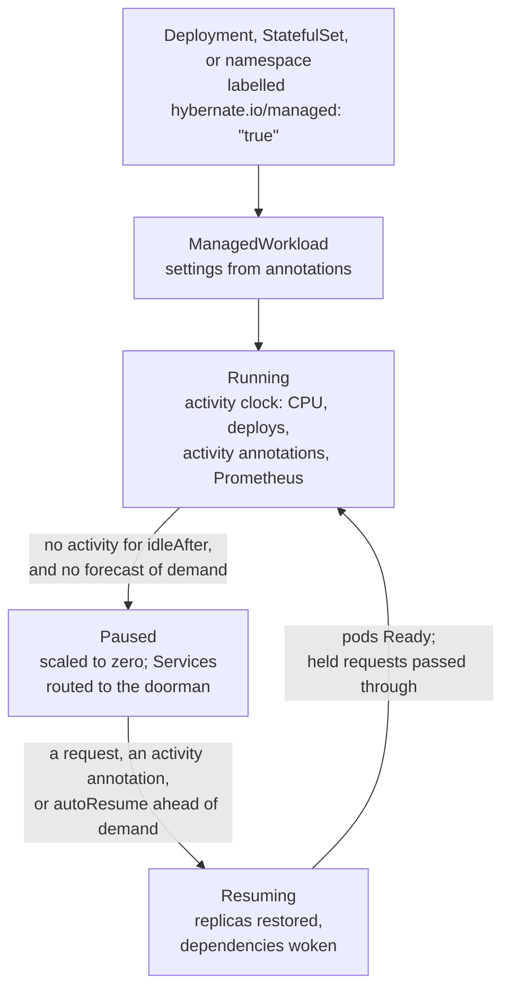

# Hybernate

**Intelligent Kubernetes workload lifecycle management.**

Hybernate is a Kubernetes operator that predicts your workload demand using Holt-Winters forecasting and pauses and resumes workloads to cut infrastructure costs. It never deletes a workload or its data: the most it does is scale one to zero, and a request wakes it. It pauses a workload once nothing has used it for a configurable time, and supports dry run mode so you can observe its recommendations and build confidence before letting it drive actions.

---

## Why Hybernate?

Most Kubernetes clusters run workloads 24/7, even when no one is using them. Dev environments sit idle overnight. Staging clusters burn resources on weekends. Production services stay at peak capacity long after traffic drops.

Hybernate fixes this by learning your workload patterns and acting on them:

- **Idle workloads get paused.** They are scaled to zero when no one is using them and resumed automatically when demand returns.

## Key Features

### Demand Forecasting
A Holt-Winters double seasonal model learns daily and weekly traffic patterns for each workload. Once it has seen every hour of the day, it starts scoring its predictions, and acts on them only when they're accurate enough. If traffic patterns shift, a built-in anomaly detector notices the drift, demotes the model's confidence, and re-learns from the new baseline.

### Activity Clock
Hybernate records the last time each workload was in use: CPU above a threshold, a deploy, or an activity annotation from your own tooling. Once nothing has been active for `idleAfter`, it pauses the workload. There's no learning period.

### Safe by Default
Hybernate never pauses a workload it can't measure, and a confident forecast can hold off a pause. Enable `dryRun` mode to see what Hybernate would do without it ever pausing anything. A paused workload scaled up by anyone else is treated as woken, and a GitOps tool undoing a pause is reported with the fix, not fought.

### Cost Tracking
Track per-workload resource consumption and savings. See exactly how much you're saving from paused workloads.

### Label Opt-In
Label a workload or namespace `hybernate.io/managed: "true"` and Hybernate manages it, with its settings as annotations. Both live in the manifests or Helm values you already keep in Git, so Argo CD and Flux work as they do today.

### Scan Before You Install
`kubectl hybernate scan` shows which workloads in a cluster are idle right now and what they cost while running, with nothing installed in the cluster.

### Full Observability
Prometheus metrics for operator health, lifecycle transitions, wakes on request, and prediction confidence, with alerting rules included.

---

## How It Works



---

## Quick Example

```yaml title="deployment.yaml" linenums="1"
apiVersion: apps/v1
kind: Deployment
metadata:
  name: my-api
  namespace: dev
  labels:
    hybernate.io/managed: "true"
  annotations:
    hybernate.io/dry-run: "true"
    hybernate.io/idle-after: "1h"
```

Hybernate watches `my-api` and records each time it's active: CPU above 10% of its requests, a deploy, or an activity annotation, and, with a [Prometheus query](guides/prometheus-signals.md), its request rate. In dry-run it only measures; once you run `kubectl hybernate enable my-api -n dev`, it pauses the Deployment after an hour with no activity, and wakes it when a request reaches its Service.

For every setting, see [Opting In](guides/opt-in.md). For settings annotations don't cover, write a [ManagedWorkload](guides/managed-workload.md) yourself.

---

## Getting Started

Ready to try it? Head to the [Installation](getting-started/installation.md) guide, then follow the [Quickstart](getting-started/quickstart.md) to manage your first workload in under 5 minutes.
